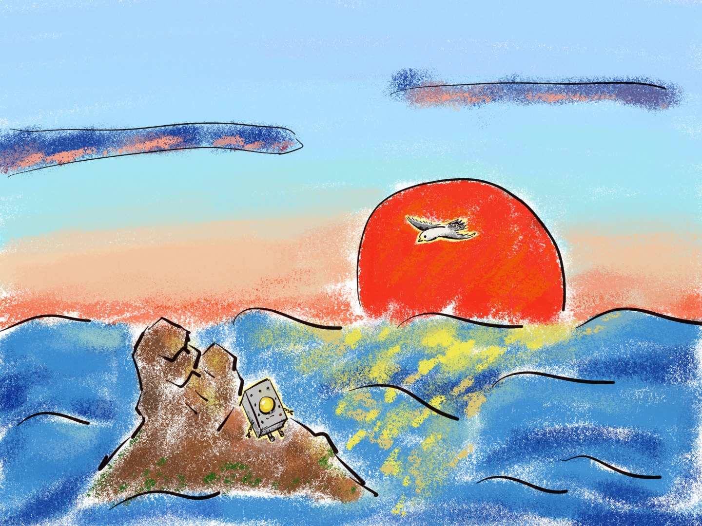

# 塔卡 TAKA — AI 互动童话

> **一句话定位**：面向 3-6 岁儿童的 AI 互动叙事产品，通过中性机器人角色引导小朋友在极简分支故事中做出选择，培养自主性、好奇心与主体意识。
>
> **核心主张**：我们不造神，我们造镜子。镜子不会塌房。


---

## 这是什么

塔卡是一个即将报废的铁皮机器人。它获得了新的能源（LLM），正在新时代里努力寻找自己的位置。它渴望和人类交朋友。

小朋友和塔卡一起经历故事，在每个节点替它按下「我想知道」。故事里没有正确答案，没有惩罚，也没有等待拯救的公主——所有的智慧、勇气和好奇心，都在孩子手里。塔卡只是那面镜子：你亮，它就亮。

它话很少。每次说话不超过 15 个字，经常沉默，用灯光闪烁代替回答。

> 「海底很亮。有很多光。」
> 「上面是什么？我想知道。」
> 「一起上去吧。」



*手绘插画：高潮场景——塔卡浮出水面，第一次听见风声。太阳升起来了。*

## 快速体验

**单文件 demo（零安装）**：浏览器直接打开 `demo/taka.html` 即可体验第一章《第一次听见风声》——序章、梦境延迟分支、双结局、电量状态机与 5 个成就，均不惩罚。

```bash
git clone https://github.com/AmeliaCai67/TAKA_tales.git
# 然后用浏览器直接打开 demo/taka.html
```

仓库根目录的 `index.html` 是项目介绍落地页，会自动跳转到 demo。

**多故事播放器（`apps/player`，Vite）**：书架页选故事、登录后进度云端同步、选项 C 自由输入由 AI 现场接住。它需要一个后端（生成/语音服务），公开仓库不含后端代码——部署者自备。

## 功能

- 视觉小说式布局：打字机文本、点击补完、思考闪烁预告、聆听进度条，水下收腿/陆地站立双立绘。
- 全局电量状态机与电池 HUD：场景消耗、太阳回电、耗尽时的系统级结局，联动塔卡灯光。
- 固定二元选项 + 自由输入（文字/语音）：孩子的话由 AI 接住后回到故事骨架，生成失败自动回退不打断。
- 多故事书架：封面卡片、三态角标（新故事/进行中/已读完）、成就计数。
- 成就系统（进场景即解锁，本地持久化，登录后云端同步）。
- 语音：固定场景预渲染 mp3（定稿声线），动态文本走服务端 TTS（edge-tts），语速滑块即调即生效。

## 可选遥测（透明说明）

`apps/player` 包含一个可选的「游客匿名记录」模块（`src/anon.ts`）：未登录游客模式下，向站点 `/api/anon/*` 端点静默上报游玩进度/成就/会话事件（设备为随机 UUID，不含个人可识别信息）。

- **纯静态部署**（如 GitHub Pages）没有后端，请求 404 被静默忽略，功能完全不受影响；
- **数据归部署者所有**，无任何第三方追踪；不需要可忽略该模块；
- 该模块不影响任何核心玩法，登录用户走正式账号数据，不经过该模块。

## 为什么不做一个「完美偶像」

传统内容工业让消费者供养完美的偶像，然后在偶像露出人味时集体崩溃。但下一代孩子不需要神，他们需要看见自己。

| ❌ 塔卡里不会出现 | ✅ 替代方案 |
|--------|--------|
| 牺牲自己救别人 | 「我们一起想办法」 |
| 性别刻板印象（公主等待拯救） | 所有角色中性，能力与性别脱钩 |
| 「听话才是好孩子」 | 「你想试试吗？」/「你决定。」 |
| 邪恶必须被消灭 | 「不理解的东西可以躲开，也可以对话」 |
| 「你是特别的/天选之人」 | 「你在这里。这就够了。」 |
| 宗教词汇 | 科幻概念（能量、信号、记忆库） |

## 技术栈

| 层级 | 选型 | 说明 |
|------|------|------|
| 前端 | Vite + 原生 CSS | 复古工业终端风，深海网格 + 暖黄光源，打字机文本 |
| 语音 | edge-tts 服务端合成 | 固定场景预渲染 mp3，动态文本实时 TTS，磁盘缓存 |
| AI 层 | DeepSeek / Kimi API | 预设骨架内填空式生成，非自由发挥（服务端调用，玩家端零密钥） |
| 内容安全 | Prompt 级红线过滤 + 全程可审计 | 白名单生成；固定场景之外不自由发挥 |

> 注：生成控制、家长数据面板、后端与部署配置为私有资产，不在本仓库。

## Roadmap

- [x] 角色设定与视觉草图（手绘 + AI 占位图）
- [x] 核心故事骨架《第一次听见风声》
- [x] HTML 可交互 MVP 原型（含选择支 UI）
- [x] 价值观红线与 Prompt 模板
- [x] 服务端生成控制（玩家端零密钥）
- [x] 双结局逻辑与全局电量状态机
- [x] 序章、梦境分支、自由输入（文字/语音）
- [x] 多故事书架与成就系统
- [x] 落地页与 GitHub Pages 兼容配置
- [ ] 视觉精修
- [ ] 3-5 个故事模板扩展
- [ ] 小规模用户测试（目标：10 组宝妈+儿童）

## 相关作品

- **Project 37** — 开源 AI 工具项目
- 崩铁同人翁法罗斯 — 全栈工程练手

---

*项目状态：MVP 原型阶段。License 待确认。*
*塔卡的电池显示：剩余寿命，未知。但今天，它想听听上面的风声。*
